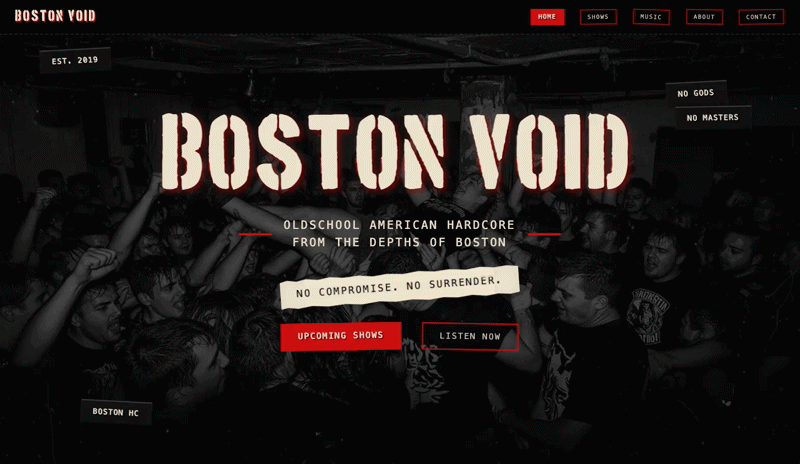
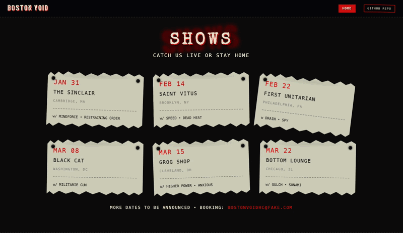

# Boston Void  
**Fictional American Hardcore Band – One Page Branding Concept**



## Overview

Boston Void is a fictional American hardcore band brought to life as a fully designed one-page website.

This project is not just a layout exercise – it is a branding and atmosphere concept translated into code.

The goal was to combine:

- Raw DIY aesthetics
- Physical flyer references
- Analog grit
- Modern frontend structure
- Subtle interaction and motion

Built loud. No compromise.

---

## Concept

The visual language is inspired by:

- Basement shows
- Pinned paper flyers
- Stamped zines
- Glitch typography
- Analog noise

Each section is designed to feel slightly physical — not purely digital.

For example, the "Shows" section simulates concert flyers pinned to a wall.  
One of them hangs loosely, subtly animated to mimic real-world movement.



---

## Technical Highlights

- Structured CSS architecture (base, components, sections)
- Custom glitch text effect
- CSS-based physical illusion (pins & paper depth)
- Responsive behavior with motion adjustments
- `prefers-reduced-motion` support
- Section-based styling separation
- Clean semantic HTML

No frameworks.  
No templates.  
Pure HTML, CSS and a small amount of JavaScript.

---

## Special Effects

- Subtle flyer sway animation (desktop only)
- Responsive fallback (stable layout on mobile)
- Section-based interaction logic
- Scroll-aware navigation highlighting

---

## Structure

```
├── README.md
├── assets/
│   ├── css/        # Styles (base, components, sections)
│   ├── fonts/      # Custom typography
│   ├── images/     # Backgrounds & album artwork
│   └── js/         # Scroll & interaction logic
├── index.html
├── screenshots/    # README preview GIFs
└── special-effects.html
```

The CSS is structured to separate:

- Global styling
- Reusable components
- Section-specific styling
- Utility classes

---

## Purpose

This project explores how frontend can be used to create atmosphere and narrative — not just layout.

It demonstrates attention to:

- Detail
- Interaction
- Structure
- Responsive behavior
- Design consistency

---

## Meta

From vinyl to viewport.  
Built loud.